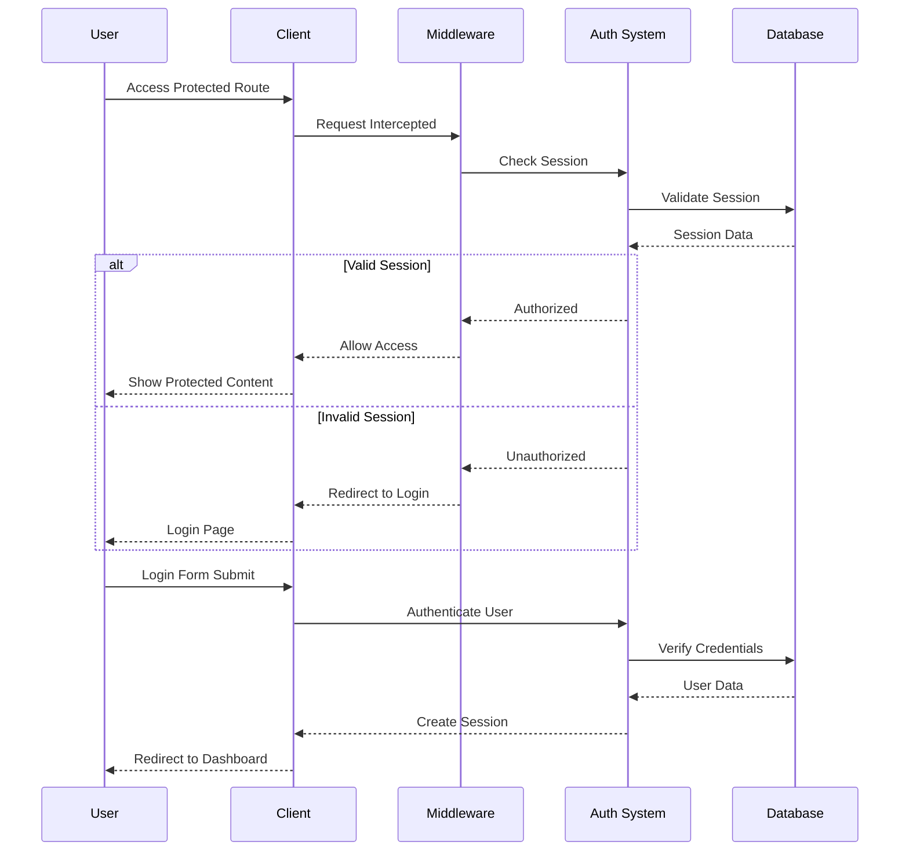
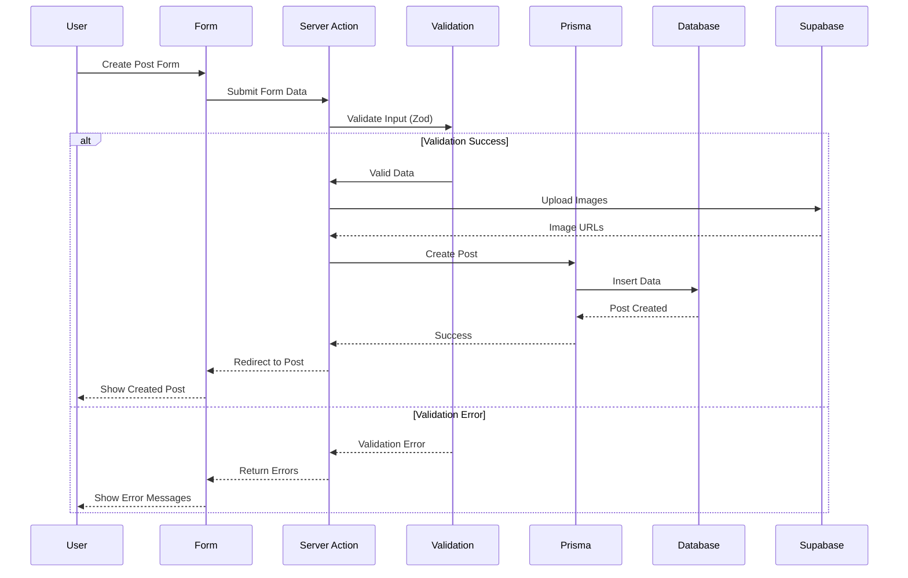
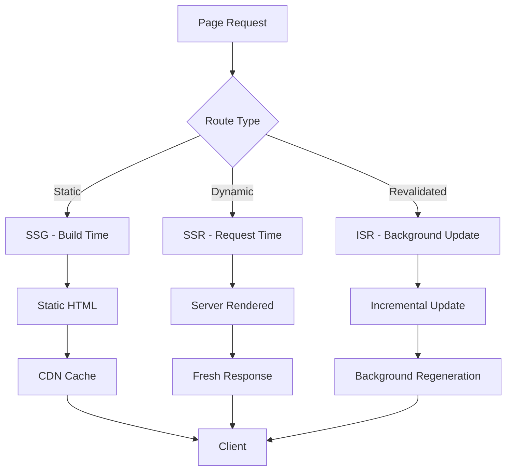
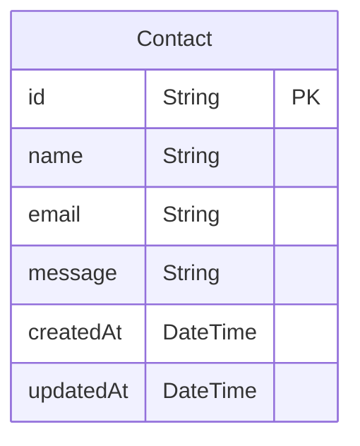
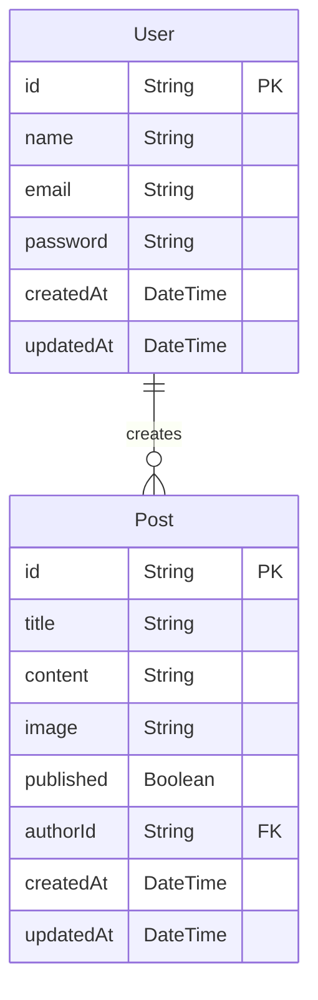
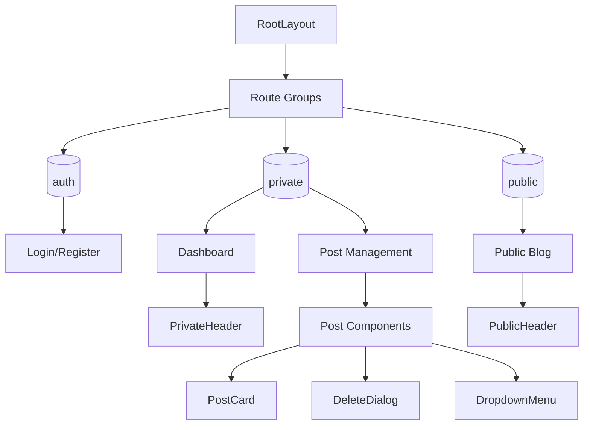

# Next.js Learning Project Documentation

このプロジェクトは、Next.js 15の学習を目的とした2つのアプリケーションで構成されています。

## プロジェクト概要

### 1. next-udemy-basic
基本的なNext.js 15アプリケーション（App Router、TypeScript、Tailwind CSS）

### 2. next-udemy-blog
高度なブログアプリケーション（認証、CRUD機能、UI/UXコンポーネント）

## アーキテクチャ構成図

```mermaid
graph TB
    subgraph "Repository Structure"
        A[nextjs-learning] --> B[next-udemy-basic]
        A --> C[next-udemy-blog]
        A --> D[docs]
        A --> E[CLAUDE.md]
        A --> F[README.md]
    end

    subgraph "next-udemy-basic Architecture"
        B --> G[src/app - App Router]
        B --> H[src/components - Components]
        B --> I[src/lib - Business Logic]
        B --> J[prisma - Database]
        G --> K[Pages & Layouts]
        G --> L[API Routes]
        G --> M[Middleware]
    end

    subgraph "next-udemy-blog Architecture"
        C --> N[src/app - Route Groups]
        C --> O[src/components - UI System]
        C --> P[src/lib - Server Actions]
        C --> Q[prisma - Blog DB]
        N --> R[(auth) - Authentication]
        N --> S[(private) - Dashboard]
        N --> T[(public) - Blog]
        O --> U[UI Components]
        O --> V[Auth Components]
        O --> W[Post Components]
    end

    subgraph "Technology Stack"
        X[Next.js 15] --> Y[React 19]
        X --> Z[TypeScript]
        X --> AA[Tailwind CSS]
        X --> BB[Prisma ORM]
        C --> CC[NextAuth.js]
        C --> DD[Supabase]
        C --> EE[Radix UI]
    end
```

## システム構成

### next-udemy-basic
```mermaid
graph LR
    subgraph "Frontend Layer"
        A[Client Components] --> B[Server Components]
        B --> C[App Router Pages]
    end

    subgraph "Business Logic Layer"
        D[Server Actions] --> E[Validation (Zod)]
        E --> F[Prisma Client]
    end

    subgraph "Data Layer"
        F --> G[(SQLite DB)]
    end

    C --> D
    B --> D
```

### next-udemy-blog
```mermaid
graph TD
    subgraph "Authentication Layer"
        A[NextAuth.js] --> B[Credentials Provider]
        A --> C[Session Management]
    end

    subgraph "Authorization Layer"
        D[Middleware] --> E[Route Protection]
        D --> F[Role-based Access]
    end

    subgraph "Application Layer"
        G[Public Routes] --> H[Authentication Pages]
        I[Private Routes] --> J[Dashboard]
        I --> K[Post Management]
    end

    subgraph "Data Management"
        L[Server Actions] --> M[Prisma ORM]
        M --> N[(SQLite DB)]
        L --> O[File Upload (Supabase)]
    end

    C --> D
    E --> G
    E --> I
    J --> L
    K --> L
```

## 処理フロー図

### ユーザー認証フロー (next-udemy-blog)


### ブログ投稿フロー


### レンダリング戦略フロー


## データベース設計

### next-udemy-basic (Contacts)


### next-udemy-blog (Blog System)


## コンポーネント階層

### next-udemy-basic
```mermaid
graph TD
    A[RootLayout] --> B[Page Components]
    A --> C[Global Styles]
    
    B --> D[Static Pages]
    B --> E[Dynamic Pages]
    B --> F[API Routes]
    
    D --> G[Home]
    D --> H[About]
    D --> I[Contacts]
    
    E --> J[Blog/[id]]
    E --> K[Auth Pages]
    
    F --> L[Hello API]
```

### next-udemy-blog


## 開発ガイドライン

### セットアップ手順

#### next-udemy-basic
```bash
cd next-udemy-basic
npm install
npx prisma generate
npx prisma migrate dev
npm run dev
```

#### next-udemy-blog
```bash
cd next-udemy-blog
npm install
npx prisma generate
npx prisma migrate dev
npx prisma seed
npm run dev
```

### 技術仕様

| 項目 | next-udemy-basic | next-udemy-blog |
|------|------------------|-----------------|
| Next.js | 15.3.4 | 15.1.1 |
| React | 19.0.0 | 19.0.0 |
| TypeScript | ✅ | ✅ |
| Tailwind CSS | 4.0 | 3.4.1 |
| Prisma | 6.13.0 | 6.2.1 |
| 認証 | - | NextAuth.js 5.0 |
| UI Library | - | Radix UI |
| 画像保存 | - | Supabase |

### フォルダ構成

```
next-udemy-basic/
├── src/
│   ├── app/          # App Router pages
│   ├── components/   # Reusable components
│   └── lib/          # Business logic & utilities
└── prisma/           # Database schema

next-udemy-blog/
├── src/
│   ├── app/
│   │   ├── (auth)/   # Authentication routes
│   │   ├── (private)/ # Protected routes
│   │   └── (public)/ # Public routes
│   ├── components/   # UI components
│   ├── lib/          # Server actions & utilities
│   └── types/        # TypeScript definitions
└── prisma/           # Database & seeding
```

## パフォーマンス最適化

### レンダリング戦略
- **SSG**: 静的コンテンツ（About, Home）
- **SSR**: 動的コンテンツ（Blog posts with fresh data）
- **ISR**: 定期更新コンテンツ（Blog index with revalidation）

### コード分割
- Route-based splitting (App Router)
- Component-level lazy loading
- Dynamic imports for heavy components

## セキュリティ考慮事項

### 認証・認可
- NextAuth.js による安全な認証
- セッション管理とCSRF保護
- ミドルウェアによるルート保護

### データ検証
- Zodによる型安全な入力検証
- サーバーサイドバリデーション
- SQL injection防止（Prisma ORM）

## デプロイメント

### Vercel推奨設定
```json
{
  "buildCommand": "npm run build",
  "outputDirectory": ".next",
  "installCommand": "npm install",
  "framework": "nextjs"
}
```

### 環境変数
```env
# Database
DATABASE_URL="file:./dev.db"

# Authentication (blog only)
NEXTAUTH_URL="http://localhost:3000"
NEXTAUTH_SECRET="your-secret"

# Supabase (blog only)
NEXT_PUBLIC_SUPABASE_URL="your-supabase-url"
NEXT_PUBLIC_SUPABASE_ANON_KEY="your-supabase-key"
```

---

このドキュメントは、Next.js学習プロジェクトの包括的な技術文書として作成されました。各アプリケーションの特性と技術スタックを理解し、効果的な開発を支援することを目的としています。