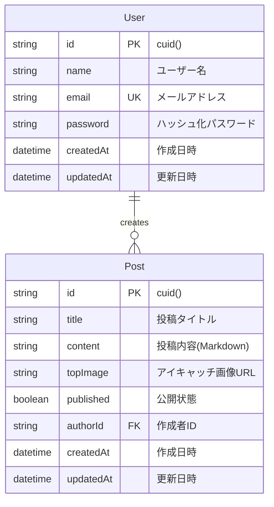
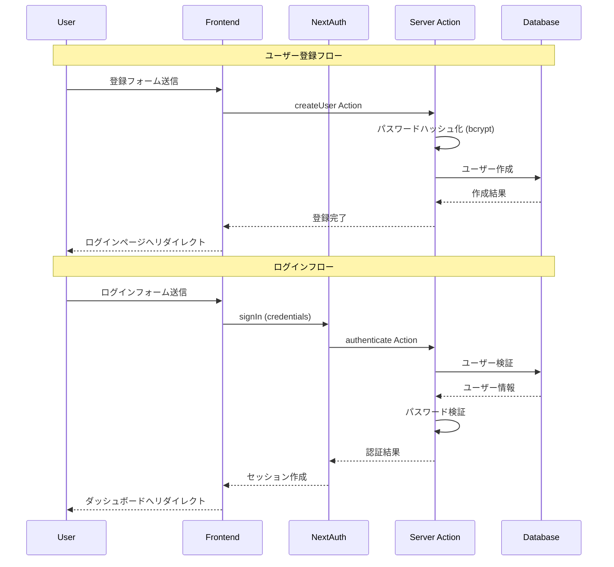
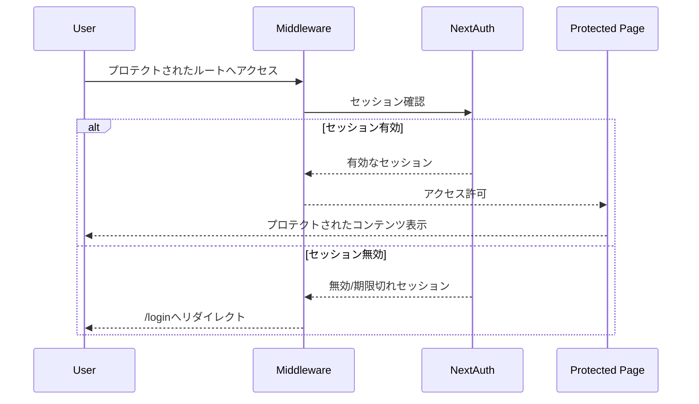
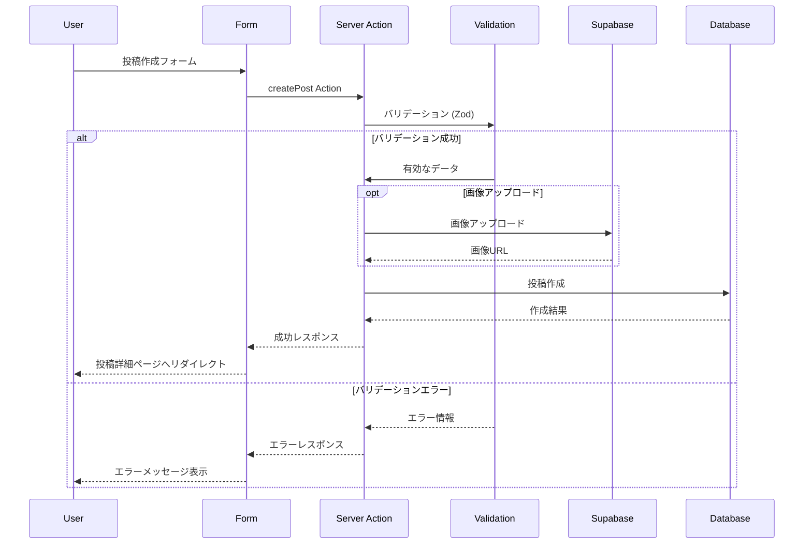
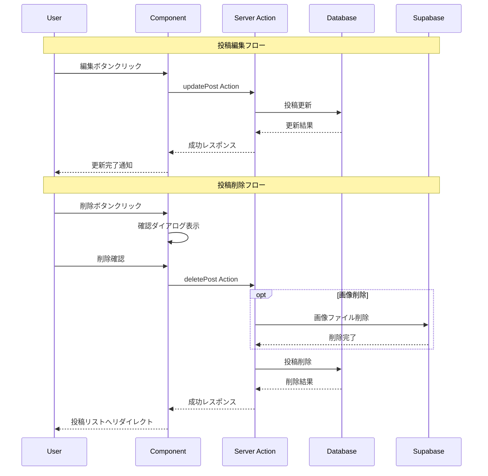
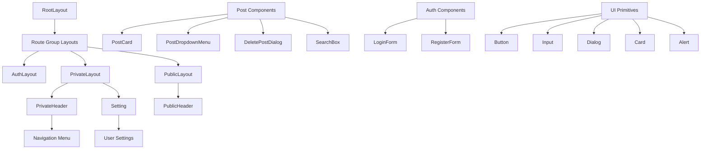
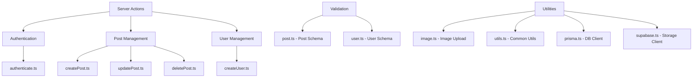
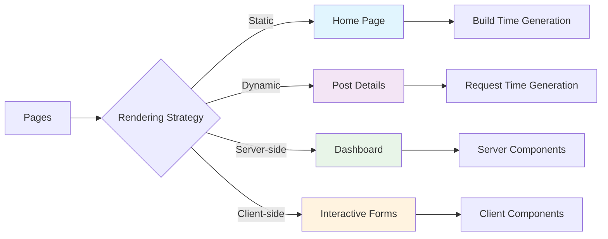
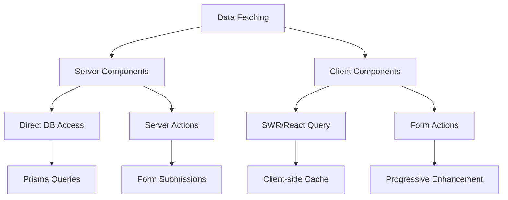

# Next.js Blog Application Documentation

## プロジェクト概要

Next.js 15とNextAuth.js 5.0を使用した高機能ブログアプリケーション。認証機能、投稿管理、Markdown対応、画像アップロード機能を備えた完全なブログシステム。

## アーキテクチャ構成図

### システム全体構成
```mermaid
graph TB
    subgraph "Frontend Layer"
        A[React Components] --> B[Route Groups]
        B --> C[(auth) - Authentication]
        B --> D[(private) - Dashboard]  
        B --> E[(public) - Blog]
    end

    subgraph "Authentication Layer"
        F[NextAuth.js 5.0] --> G[Credentials Provider]
        F --> H[Session Management]
        F --> I[Middleware Protection]
    end

    subgraph "Business Logic Layer"
        J[Server Actions] --> K[Form Validation]
        J --> L[Data Operations]
        K --> M[Zod Schemas]
    end

    subgraph "Data Layer"
        N[Prisma ORM] --> O[(SQLite Database)]
        P[Supabase] --> Q[Image Storage]
    end

    subgraph "UI Framework"
        R[Tailwind CSS] --> S[Custom Styling]
        T[Radix UI] --> U[Accessible Components]
        V[Lucide Icons] --> W[Icon System]
    end

    A --> F
    C --> F
    D --> I
    E --> J
    J --> N
    A --> T
    A --> R
```

### Route Groups構成
```mermaid
graph TD
    A[src/app] --> B[(auth)]
    A --> C[(private)]
    A --> D[(public)]
    
    B --> E[layout.tsx - Auth Layout]
    B --> F[login/page.tsx]
    B --> G[register/page.tsx]
    
    C --> H[layout.tsx - Private Layout]
    C --> I[dashboard/page.tsx]
    C --> J[manage/posts/...]
    
    D --> K[layout.tsx - Public Layout]
    D --> L[page.tsx - Home]
    D --> M[posts/[id]/page.tsx]
    
    J --> N[create/page.tsx]
    J --> O[[id]/page.tsx - Post Detail]
    J --> P[[id]/edit/page.tsx]
```

## データベース設計

### ERD (Entity Relationship Diagram)


### データベース制約
- **User.email**: UNIQUE制約
- **Post.authorId**: User.idへの外部キー (CASCADE DELETE)
- **Post.published**: デフォルト値 true

## 認証フロー

### ユーザー登録・ログインフロー


### 認証保護フロー


## ブログ投稿管理フロー

### 投稿作成フロー


### 投稿編集・削除フロー


## コンポーネント構成

### UI Components階層


### Server Actions構成


## レンダリング戦略

### ページ別レンダリング手法


### データフェッチング戦略


## 技術仕様

### 開発環境セットアップ
```bash
# プロジェクトセットアップ
cd next-udemy-blog
npm install

# データベースセットアップ
npx prisma generate
npx prisma migrate dev
npx prisma db seed

# 開発サーバー起動
npm run dev
```

### 主要依存関係

| カテゴリ | パッケージ | バージョン | 用途 |
|----------|------------|------------|------|
| フレームワーク | Next.js | 15.1.1 | Reactフレームワーク |
| 認証 | NextAuth.js | 5.0.0-beta.25 | 認証システム |
| データベース | Prisma | 6.2.1 | ORM |
| UI | Radix UI | 各種 | アクセシブルコンポーネント |
| スタイリング | Tailwind CSS | 3.4.1 | CSS フレームワーク |
| 画像保存 | Supabase | 2.48.1 | ファイルストレージ |
| バリデーション | Zod | 3.24.1 | スキーマ検証 |
| Markdown | react-markdown | 9.0.3 | Markdownレンダリング |

### 環境変数設定
```env
# Database
DATABASE_URL="file:./dev.db"

# NextAuth
NEXTAUTH_URL="http://localhost:3000"
NEXTAUTH_SECRET="your-nextauth-secret"

# Supabase
NEXT_PUBLIC_SUPABASE_URL="your-supabase-project-url"
NEXT_PUBLIC_SUPABASE_ANON_KEY="your-supabase-anon-key"
SUPABASE_SERVICE_ROLE_KEY="your-supabase-service-role-key"
```

## セキュリティ考慮事項

### 認証セキュリティ
- bcryptjsによるパスワードハッシュ化
- CSRF保護 (NextAuth.js内蔵)
- セッション管理とタイムアウト
- ミドルウェアによるルート保護

### データ保護
- Zodによる入力値検証
- Prismaによる型安全なDB操作  
- SQL injection防止
- XSS対策 (React標準)

### ファイルアップロード
- Supabaseによる安全なファイル保存
- 画像フォーマット検証
- ファイルサイズ制限

## パフォーマンス最適化

### 最適化手法
- App Routerによるコード分割
- Server Componentsの活用
- 画像最適化 (Next.js Image)
- 静的生成の活用

### 監視とデバッグ
- Next.js DevToolsの活用
- Prisma Studio でのデータ確認
- コンソールログの適切な使用

## デプロイメント

### Vercel推奨設定
```json
{
  "framework": "nextjs",
  "buildCommand": "npm run build",
  "outputDirectory": ".next",
  "installCommand": "npm install"
}
```

### 本番環境考慮事項
- PostgreSQL等の本番DB移行
- 環境変数の適切な設定
- 画像CDN設定
- セキュリティヘッダー設定

---

このドキュメントは、Next.js Blogアプリケーションの包括的な技術文書として、開発・運用・保守の指針を提供します。